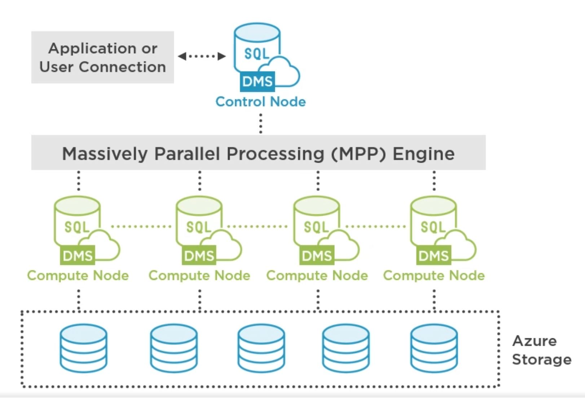
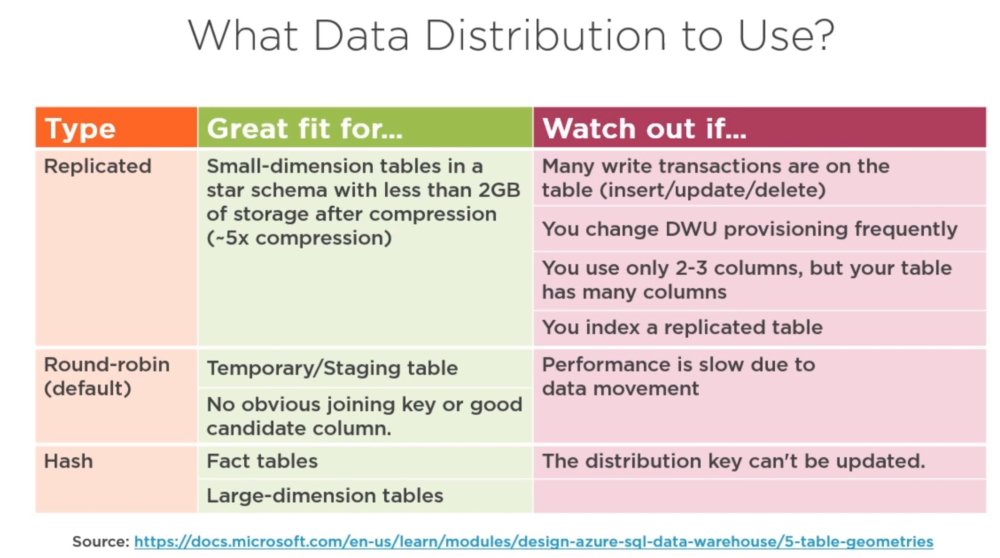

<h3> Understanding Azure Synapse Analytics </h3>

 Synapse Analytics is a combination of Azure Data Lake Storage, Azure SQL Data Warehouse and Azure Analytics 

 Clouse base enterprise data warehouse (EDW) that uses massiveley parallel processing (MPP) 

 SQL Data Warehouse is most appropriate when you need to keep historical data seperate from transaction 

 The data is not necessary there for transactional purposes. You have a warehouse of all your data. And it's sitting there for waiting for analyitcs to happen to it. 

<h3> Understanding massively parallel processing (MMP) </h3>

 Have processing acting in parallel with different nodes that you have of your storage. At the bottom is the Azure storage that we keep our data. It is seperate from the compute power that will cost the most money 

 <b> Control Node </b> The front end that interacts with all applications and connections. The MPP enginge runs on the control node to optimize and coordinate parallel queries.  

 <b> Compute Node </b> Provide the computational power for analytics. Separated from storage nodes. These are scaled using data warehouse units (DWU)  

 <b> Storage Node </b> Separate from Compute in order to keep data at rest. This is cheaper than data that is being analyzed.  

 <b> Data Warehouse unit </b> A collection of analytic resources that are provisioned. This is a combination of CPU, memory and IO (Input/output). These can be scaled to up or down to meet needs. 

 <b> Data Movement Service </b> Data transport technology that coordinates data movement between compute nodes. When SQL Data Warehouse runs a query, the work is divided into 60 smaller queries that run in parallel.  

<b> Implementing Data Distribution for an SQL Data Warehouse </b> 
 

 A distribution is the basic unit of storage and processing for parallel queries. Rows are stored across 60 distributions which are run in parallel. Each Compute node manages one or more of the 60 distributions.

 Three types of distribution. Replicated Table, this cache is a full copy of each compute node. Extra storage is requried but has the fastet query time. Next table is the Round Robin. Round Robin distributes data evenly across the table without additional optimization. Loading data into Round Robin is quick but query performance is better for Hash. Joins require shuffeling of data. Hash distributed table uses a hash function to assign each row to one distribution deterministicly.    

<b> Implemening Partitions for an SQL Data Warehouse </b>

 Table partitions enable you to divide your data into samller groups of data. Improve the efficiency and performance of loading data by use of partition deletion, switching and merging 

 Improve the efficiency and performance of loading data by use of pration deletion, switching and mering 

 Usually data is partitioned on a date columns tied to when the data is loaded into the database 

 Can also be used to improve the query performance 

 Table Partitions, Clustered columnstore, clustered index, heap  

 Sizing partitions, dont use to many table and to many partitions because it take up processing power, usually you talk around 10 to few hundreds. For clustered columnstore tables, it is important to consider how many rows belong to each partions. Before paritions are created SQL Data Warehouse already divides each table into 60 distributed databases. 
  
  ---

<h3> </h3>

 Computing is any activity that uses computers to manage, process and communicate information 

 Browser Cache: A way to make website faster for you when your browsing the internet. When you visit the website, it basically downloads a copy of the website and stores it on your harddrive. Next time you load website it goes really fast. 

<a href="https://www.youtube.com/watch?v=yi0FhRqDJfo"> Video Explanation </a>

CPU Cache: A computer have two different types of memory. Dynamic RAM, SRAM (used in CPU Cache). SRAM does not have to be constantly refreshed. Much faster than DRAM but more expensive. The CPU Cache is the CPU internal memory. It's job is to store copy of data from RAM which is wainting to be used by the CPU. Basically what the CPU Cache does, is that it holds common data that it thinks the CPU will access. CPU always check cache memory first. 

