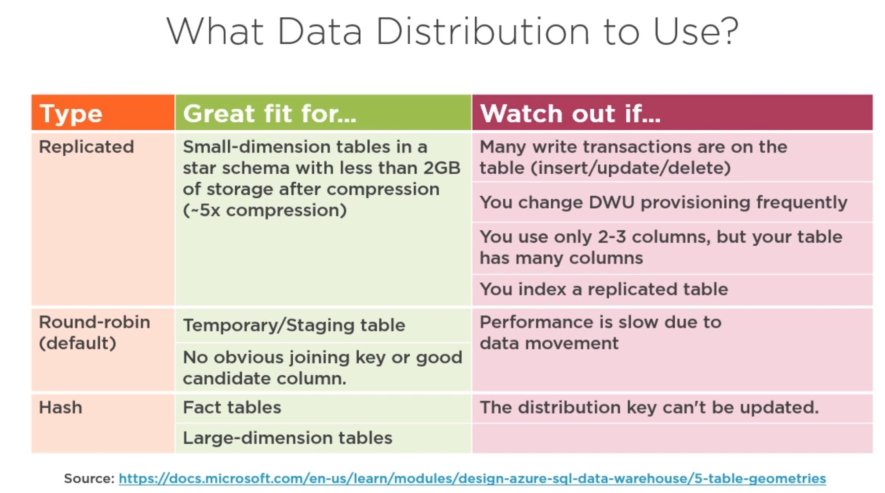

<h1> Implementing a Cloud Data Warehouse in Microsoft Azure Synapse Analytics </h1>

<ul> 
<b> What is a Data Warehouse?  </b>
<li> Data warehousing is a technology that aggregates structured data from one or more sources so that it can be compared and analyzed </li>
<li> It's reasonable to use Data Warehouse when you have historical data that is sitting there, ready for analytics to be applied to it </li>
<li> Rather than to soak in data (like a database), a data warehouse is designed to produce data for analysis. That is, a database is designed to record while a data warehouse is designed to analyze. </li>
<li> For a Data Warehouse, the datas purpose is defined (structured and highly transformed). For a Data Lake the datas purpose is not yet determined. </li>
 
<b> What is Azure SQL Data Warehouse? </b> 
  
<li> Azure SQL Data Warehouse is a cloud based enterprise Data Warehouse and uses massiveley parallel processing (MPP)</li>
<li> Azure SQL Data Warehouse and Azure Synapse Analytics are used interchangeably (the same thing) </li>
<li> Massively parallel processing can be described as multiple processing nodes (computers) which are interconnected to each other and kept in the same chassi. </li>
 
<b> What are best practises for Azure SQL Data Warehouse? </b>
  
<li> Data warehouses often contain large tables, and require techniques for both managing these large tables and providing good query performance </li>
<li> Data distribution allows the work of a query to be divided into 60 smaller queries that run in parallel.
<li> Data partitioning allows a table, index, or index-organized table to be subdivided into smaller pieces, where each piece of such a database object is called a partition.</li>

<h3> Understanding Azure Synapse Analytics </h3>

 Synapse Analytics is a combination of: 

<ul>
  <li>Azure Data Lake Storage </li> 
  <li> <b> Azure SQL Data Warehouse </b> </li>
  <li>Azure Analytics</li>
</ul>
 

 However, Azure SQL Data Warehouse and Azure Synapse Analytics are today used interchangeably. Azure SQL Data Warehouse is a cloud based enterprise data Warehouse (EDW) that uses <b> massiveley parallel processing (MPP)</b>. SQL Data Warehouse is an appropriate tool when you need to keep historical data seperate from transactional data. That is, it's reasonable to use Azure SQL Data Warehouse when you have <b>historical data</b> that is sitting there, ready for analytical services. 

<b> Understanding massively parallel processing (MPP) </b>

<ul>

 Massively parallel processing can be described as multiple processing nodes (computers) which are interconnected to each other and kept in the same chassi. Each computer has its own memory, disk-space, operating system and IO.  

<li> <b> Control Node: </b> The front end that interacts with all applications and connections. The MPP enginge runs on the control node to optimize and coordinate parallel queries.  </li>

<li> <b> Compute Node: </b> Provides the computational power for analytics. The compute nodes are separated from storage nodes and scaled using the data warehouse units (DWU). Computing is any activity that uses computers to manage, process and communicate information.  </li>

<li> <b> Storage Node: </b> The storage nodes are separateed from the compute nodes in order to keep data at rest. Storage is cheaper than data that is being analyzed. </li>

<li> <b> Data Warehouse unit: </b> A collection of analytic resources that are provisioned. This is a combination of CPU, memory and IO (Input/output). These can be scaled up or down to meet needs. Provisioning is the configuration,
deployment and management of IT resources. </li>

<li> <b> Data Movement Service: </b> Data transport technology that coordinates data movement between compute nodes. When SQL Data Warehouse runs a query, the work is divided into 60 smaller queries that run in parallel.  </li>
</ul>

 At the bottom of the picture is the Azure storage where the data is keept. It is seperated from the compute power (which are more expensive) 

<b> Implementing Data Distribution for a SQL Data Warehouse </b> 
 

 When SQL Analytics (in Azure Synapse) runs a query, the work is divided into 60 smaller queries that run in parallel. Each of the 60 smaller queries runs on one of the data distributions. Each Compute Node manages one or more of the 60 distributions. A SQL pool with maximum compute resources has one distribution per Compute Node. A SQL pool with minimum compute resources has all the distributions on one Compute Node.
  

 There are three types of distributions.

<ul>
  <li> Replicated Table</li>
  
  A replicated table provides the fastest query performance for small tables (full data consistency). Replicating a table removes the need to transfer data among compute nodes before a join or aggregation. Replicated tables are best utilized with small tables. Extra storage is required and there is additional overhead that is incurred when writing data which makes large tables impractical. 

  <li> Round Robin</li>
  
 Round Robin distributes data evenly across the table without additional optimization. Loading data into Round Robin is quick but query performance is better for Hash.  
 
  <li> Hash Table </li>
  
 A hash distributed table can deliver the highest query performance for joins and aggregations on large tables.
To shard data into a hash-distributed table, SQL Analytics uses a hash function to deterministically assign each row to one distribution.

</ul>
  

<b> Implemening Partitions for a SQL Data Warehouse </b>

 Table partitions enable you to divide your data into smaller groups of data. In most cases, table partitions are created on a date column. Partitioning can benefit data maintenance and query performance. Improve the efficiency and performance of loading data by the use of partition deletion, switching and merging 

 For example, a sales fact table might contain just data for the past 36 months. At the end of every month, the oldest month of sales data is deleted from the table (by using a delete statement). However, deleting large amount of data (row-by-row) with a delete statement can take long time, and creates the risk for large rollbacks if something goes wrong. A more optimal approach is to drop the oldest partition of data. Deleting the individual rows could take hours, deleting an entire partition could take seconds.

 There are three types of table partitions 

<ul>
  <li> Clustered columnstore </li>
  
 Updateable primary storage method. Great for read-only 
 
  <li> Clustured index</li>
  
 An index that is physically stored in the same order as the data being indexed. 

  <li> Heap </li>
  
 Data is not in any particular order. Use when data has no natural order (no time series) 

  
</ul>

 Creating a table with to many partitions can hurt performance under some circumstances (10 to a few hundred is resonable). For clustered columnstore tables, it is important to consider how many rows belong to each partions. Keep in mind that before partitions are created, SQL Data Warehouse already divides each table into 60 distributed databases. 
 
 
<b> Tuning and Optimizing a Data Warehouse in Microsoft Azure Synapse Analytics </b>

<ul>
	<li> Backing up a Data warehouse </li>
	
 Snapshots offers a time when your database was at a certain level, so you can restore to that level. The backup will consist of many files, since SQL Data Warehouse is distributed (exists in alot of different places). Automatic restore points are taken several times a day <b> assuming your data warehouse is not paused </b>. Overview => New Restore Point (to create your own restore point). 

	<li> Restoring a Data warehouse</li> 
	
Restor points are deleted after 7 days and are not be available when DW is paused. To restore go to "Over" (next to scale) 

	<li> Managing cost of a Data warehouse </li>
	
 The pricing page is available at Microsoft website. The cost depends on how the storage cost and the computing cost. 

	<li> Workload management </li>
	
 Workload management includes the process of loading data, running analysis, reporting, exporting and managing the data in the data warehouse. Workload classification includes when you assign users to a role that has a corresponding resource class. We do this with <pre> CREATE WORKLOAD CLASSIFIER </pre>
 
	
 Workload importance: low, below_normal, normal, above_normal, high. A request with higher importance will be run before a request with lower importance. 

	
<h3> Polybase </h3>

 The fastest way to load data into Synapse Analytics is to use Polybase. It lets you read data from external resources using T-SQL.
<ul> 
<li> Step 1: Convert your data into structured text files, such as CSV or Parquet, and put the files in either Blob Storage or Data lake Storage </li>
	<li> Step 2:</li>
	<pre> CREATE EXTERNAL DATA SOURCE
		CREATE EXTERNAL FILE FORMAT
		CREATE EXTERNAL TABLE
	</pre>
	<li> Step 3: Load the data into a stagin table in Synapse Analytics </li>
	<li> Step 4: Insert the data into production tables </li>
	

 When you are loading data into staging tables, you should use a round-robin distribution method. 

<h3> Notes </h3>

<b> Cache </b>

 CPU Cache: The CPU Cache is the CPUs internal memory. It's job is to store copy of data from RAM which is waiting to be used by the CPU. Basically what the CPU Cache does, is that it holds common data that it thinks the CPU will access. CPU always check cache memory first. A computer have two different types of memory. Dynamic RAM and SRAM (used in CPU Cache). SRAM does not have to be constantly refreshed. Much faster than DRAM but more expensive. 

Browser Cache: A way to make website faster for you when your browsing the internet. When you visit the website, it basically downloads a copy of the website and stores it on your harddrive. Next time you load website it goes really fast. 
 

<b> Ports & IP Addressing </b>

 Together IP and port number is called the socket. IP adress are used to identify what computer we are sending to or from and the port represents what application or service we are sending to and from. If you are using windows open command and type netstat -a -b -n (with admin privelage) to find port numbers. Common port numbers: HTTP 80, FTP (File transfer) 20 
 

<b> Firewall </b>

 A Firewall is a system that is designed to prevent unauthorized access to enter a private network by filtering information that comes in from the internet. A Firewall blocks unwanted traffic and permits wanted traffic. Firewall => Router => Computer. A Firewall works by filtering the incomming network data and determines by its rules if its allowed to enter a network. These rules are customizable and determined by the network administrator. Generally Firewalls allow data to go out.  

